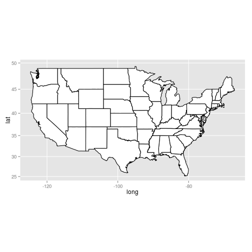
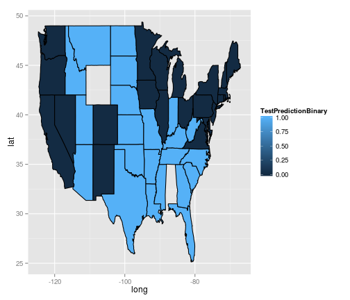
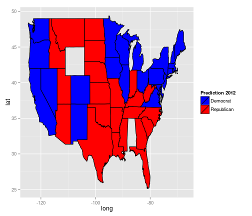
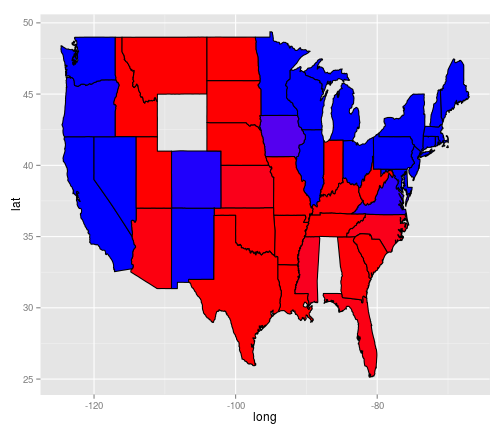

#ELECTION FORECASTING REVISITED
========================================================

In the recitation from Week 3, we used logistic regression on polling data in order to construct US presidential election predictions. We separated our data into a training set, containing data from 2004 and 2008 polls, and a test set, containing the data from 2012 polls. We then proceeded to develop a logistic regression model to forecast the 2012 US presidential election.

In this homework problem, we'll revisit our logistic regression model from Week 3, and learn how to plot the output on a map of the United States. Unlike what we did in the Crime lecture, this time we'll be plotting predictions rather than data!

First, load the ggplot2, maps, and ggmap packages using the library function. All three packages should be installed on your computer from lecture, but if not, you may need to install them too using the install.packages function.

```r
require(ggplot2)
```

```
## Loading required package: ggplot2
```

```r
require(maps)
```

```
## Loading required package: maps
```

```r
require(ggmap)
```

```
## Loading required package: ggmap
```


Then, load the US map and save it to the variable statesMap, like we did during the Crime lecture:


```r
statesMap = map_data("state")
```


The maps package contains other built-in maps, including a US county map, a world map, and maps for France and Italy.

## Section 1
========================================================

###PROBLEM 1.1 - DRAWING A MAP OF THE US  (1 point possible)
If you look at the structure of the statesMap data frame using the str function, you should see that there are 6 variables. One of the variables, group, defines the different shapes or polygons on the map. Sometimes a state may have multiple groups, for example, if it includes islands. How many different groups are there?


```r
str(statesMap)
```

```
## 'data.frame':	15537 obs. of  6 variables:
##  $ long     : num  -87.5 -87.5 -87.5 -87.5 -87.6 ...
##  $ lat      : num  30.4 30.4 30.4 30.3 30.3 ...
##  $ group    : num  1 1 1 1 1 1 1 1 1 1 ...
##  $ order    : int  1 2 3 4 5 6 7 8 9 10 ...
##  $ region   : chr  "alabama" "alabama" "alabama" "alabama" ...
##  $ subregion: chr  NA NA NA NA ...
```

```r
dim(table(statesMap$group))
```

```
## [1] 63
```


###PROBLEM 1.2 - DRAWING A MAP OF THE US  (1 point possible)
You can draw a map of the United States by typing the following in your R console:


```r
ggplot(statesMap, aes(x = long, y = lat, group = group)) + geom_polygon(fill = "white", 
    color = "black") + coord_map("mercator")
```

 


As we saw in lecture, we used the option coord_map. This sets the type of map projection. The option "mercator" just creates a flat projection. Other options include "orthographic" and "polyconic". To see all options, type ?mapproject in your R console.

We specified two colors in geom_polygon -- fill and color. Which one defined the color of the outline of the states?

__color__

## Section 2
========================================================

###PROBLEM 2.1 - COLORING THE STATES BY PREDICTIONS  (2 points possible)
Now, let's color the map of the US according to our 2012 US presidential election predictions from the Week 3 Recitation. We'll rebuild the model here, using the dataset [PollingImputed.csv](https://courses.edx.org/c4x/MITx/15.071x/asset/PollingImputed.csv). Be sure to use this file so that you don't have to redo the imputation to fill in the missing values, like we did in the Week 3 Recitation.

Load the data using the read.csv function, and call it "polling".Then split the data using the subset function into a training set called "Train" that has observations from 2004 and 2008, and a testing set called "Test" that has observations from 2012.

```r
polling = read.csv("PollingImputed.csv")
Train = subset(polling, Year %in% c(2004, 2008))
Test = subset(polling, Year == 2012)
```


Note that we only have 45 states in our testing set, since we are missing observations for Alaska, Delaware, Alabama, Wyoming, and Vermont, so these states will not appear colored in our map.

Then, create a logistic regression model and make predictions on the test set using the following commands:

```r
mod2 = glm(Republican ~ SurveyUSA + DiffCount, data = Train, family = "binomial")

TestPrediction = predict(mod2, newdata = Test, type = "response")
```


TestPrediction gives the predicted probabilities for each state, but let's also create a vector of Republican/Democrat predictions by using the following command:

```r
TestPredictionBinary = as.numeric(TestPrediction > 0.5)
```


Now, put the predictions and state labels in a data.frame so that we can use ggplot:

```r
predictionDataFrame = data.frame(TestPrediction, TestPredictionBinary, Test$State)
```


To make sure everything went smoothly, answer the following questions.

For how many states is our binary prediction 1, corresponding to Republican?

```r
table(TestPredictionBinary)
```

```
## TestPredictionBinary
##  0  1 
## 23 22
```


What is the average predicted probability of our model?

```r
mean(TestPrediction)
```

```
## [1] 0.4853
```


###PROBLEM 2.2 - COLORING THE STATES BY PREDICTIONS  (2 points possible)
Now, we need to merge "predictionDataFrame" with the map data "statesMap", like we did in lecture. Before doing so, we need to convert the Test.State variable to lowercase, so that it matches the region variable in statesMap. Do this by typing the following in your R console:

```r
predictionDataFrame$region = tolower(predictionDataFrame$Test.State)
```


Now, merge the two data frames using the following command:

```r
predictionMap = merge(statesMap, predictionDataFrame, by = "region")
```


Lastly, we need to make sure the observations are in order so that the map is drawn properly, by typing the following:

```r
predictionMap = predictionMap[order(predictionMap$order), ]
```


How many observations are there in predictionMap?

```r
dim(predictionMap)[1]
```

```
## [1] 15034
```


How many observations are there in statesMap?

```r
dim(statesMap)[1]
```

```
## [1] 15537
```


###PROBLEM 2.3 - COLORING THE STATES BY PREDICTIONS  (1/1 point)
When we merged the data in the previous problem, it caused the number of observations to change. Why? Check out the help page for merge by typing ?merge to help you answer this question.

**Because we only make predictions for 45 states, we no longer have observations for some of the states.**

###PROBLEM 2.4 - COLORING THE STATES BY PREDICTIONS  (1 point possible)
Now we are ready to color the US map with our predictions! You can color the states according to our binary predictions by typing the following in your R console:

```r
ggplot(predictionMap, aes(x = long, y = lat, group = group, fill = TestPredictionBinary)) + 
    geom_polygon(color = "black")
```

 


The states appear light blue and dark blue in this map. Which color represents a Republican prediction?
**Light blue**

###PROBLEM 2.5 - COLORING THE STATES BY PREDICTIONS  (1 point possible)
We see that the legend displays a blue gradient for outcomes between 0 and 1. However, in our model there are only two possible outcomes: 0 or 1. Let's replot the map with discrete outcomes. We can also change the color scheme to blue and red, to match the blue color associated with the Democratic Party in the US and the red color associated with the Republican Party in the US. This can be done with the following command:

```r
ggplot(predictionMap, aes(x = long, y = lat, group = group, fill = TestPredictionBinary)) + 
    geom_polygon(color = "black") + scale_fill_gradient(low = "blue", high = "red", 
    guide = "legend", breaks = c(0, 1), labels = c("Democrat", "Republican"), 
    name = "Prediction 2012")
```

 


Alternatively, we could plot the probabilities instead of the binary predictions. Change the plot command above to instead color the states by the variable TestPrediction. You should see a gradient of colors ranging from red to blue. How many states look purple in the map?

```r
ggplot(predictionMap, aes(x = long, y = lat, group = group, fill = TestPrediction)) + 
    geom_polygon(color = "black") + scale_fill_gradient(low = "blue", high = "red", 
    guide = "legend", breaks = c(0, 1), labels = c("Democrat", "Republican"), 
    name = "Prediction 2012")
```

 

**1**

##Section 3
========================================================
###PROBLEM 3.1 - UNDERSTANDING THE PREDICTIONS  (1 point possible)
What does it mean when a state appears with a purple "in-between" color on the map?

**Our logistic regression classifier is not as confident in its prediction for this state**

###PROBLEM 3.2 - UNDERSTANDING THE PREDICTIONS  (1 point possible)
In the 2012 election, the state of Florida ended up being a very close race. It was ultimately won by the Democratic party. Did we predict this state correctly or incorrectly? To see the names and locations of the different states, take a look at the World Atlas map [here](http://www.worldatlas.com/webimage/testmaps/usanames.htm).

**We incorrectly predicted this state by predicting that it would be won by the Republican party**

###PROBLEM 3.3 - UNDERSTANDING THE PREDICTIONS  (2 points possible)
What was our predicted probability for the state of Florida?

```r
predictionDataFrame$TestPrediction[predictionDataFrame$Test.State == "Florida"]
```

```
## [1] 0.964
```

