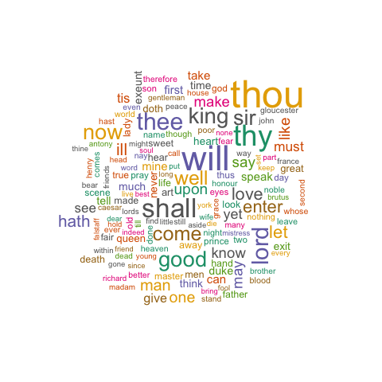
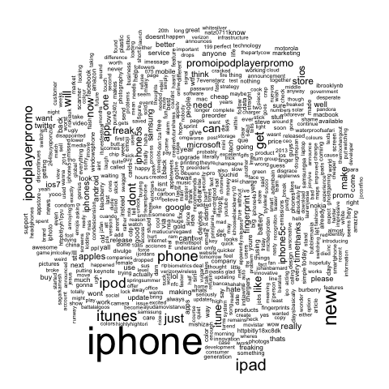

# VISUALIZING TEXT DATA USING WORD CLOUDS
========================================================


```r
require(tm)
```

```
## Loading required package: tm
```

```r
require(SnowballC)
```

```
## Loading required package: SnowballC
```


Earlier in the course, we used text analytics as a predictive tool, using word frequencies as independent variables in our models. However, sometimes our goal is to understand commonly occurring topics in text data instead of to predict the value of some dependent variable. In such cases, word clouds can be a visually appealing way to display the most frequent words in a body of text.

A word cloud arranges the most common words in some text, using size to indicate the frequency of a word. For instance, this is a word cloud for the complete works of Shakespeare, removing English stopwords:

)

While we could generate word clouds using free generators available on the Internet, we will have more flexibility and control over the process if we do so in R. We will visualize the text of tweets about Apple, a dataset we used earlier in the course. As a reminder, this dataset (which can be downloaded from [tweets.csv](https://courses.edx.org/c4x/MITx/15.071x/asset/tweets.csv)) has the following variables:

__Tweet__ -- the text of the tweet

__Avg__ -- the sentiment of the tweet, as assigned by users of Amazon Mechanical Turk. The score ranges on a scale from -2 to 2, where 2 means highly positive sentiment, -2 means highly negative sentiment, and 0 means neutral sentiment.

========================================================
## PROBLEM 1.1 - PREPARING THE DATA  (1 point possible)
Download the dataset "tweets.csv", and load it into a data frame called `tweets` using the `read.csv()` function, remembering to use `stringsAsFactors=FALSE` when loading the data.


```r
tweets = read.csv("tweets.csv", stringsAsFactors = FALSE)
```


Next, perform the following pre-processing tasks (like we did in Week 5), noting that we don't stem the words in the document or remove sparse terms:

1) Create a corpus using the Tweet variable

```r
corpus = Corpus(VectorSource(tweets$Tweet))
```


2) Convert the corpus to lowercase

```r
corpus = tm_map(corpus, tolower)
```


3) Remove punctuation from the corpus

```r
corpus = tm_map(corpus, removePunctuation)
```


4) Remove all English-language stopwords

```r
corpus = tm_map(corpus, removeWords, stopwords("english"))
```


5) Build a document-term matrix out of the corpus

```r
frequencies = DocumentTermMatrix(corpus)
```


6) Convert the document-term matrix to a data frame called allTweets

```r
allTweets = as.data.frame(as.matrix(frequencies))
```


How many unique words are there across all the documents? 

```r
dim(allTweets)[2]
```

```
## [1] 3780
```


## PROBLEM 1.2 - PREPARING THE DATA  (1 point possible)
Although we typically stem words during the text preprocessing step, we did not do so here. What is the most compelling rationale for skipping this step when visualizing text data?
**It will be easier to read and understand the word cloud if it includes full words instead of just the word stems**

========================================================
## PROBLEM 2.1 - BUILDING A WORD CLOUD  (1 point possible)
Install and load the "wordcloud" package, which is needed to build word clouds.

```r
require(wordcloud)
```

```
## Loading required package: wordcloud
## Loading required package: Rcpp
## Loading required package: RColorBrewer
```


As we can read from `?wordcloud`, we will need to provide the function with a vector of words and a vector of word frequencies. Which function can we apply to `allTweets` to get a vector of the words in our dataset, which we'll pass as the first argument to `wordcloud()`?
**colnames**

## PROBLEM 2.2 - BUILDING A WORD CLOUD  (1 point possible)
Which function should we apply to allTweets to obtain the frequency of each word across all tweets?
**colSums**

## PROBLEM 2.3 - BUILDING A WORD CLOUD  (1 point possible)
Use `allTweets` to build a word cloud. Make sure to check out the help page for `wordcloud` if you are not sure how to do this.

Because we are plotting a large number of words, you might get warnings that some of the words could not be fit on the page and were therefore not plotted -- this is especially likely if you are using a smaller screen. You can address these warnings by plotting the words smaller. From `?wordcloud`, we can see that the `scale` parameter controls the sizes of the plotted words. By default, the sizes range from 4 for the most frequent words to 0.5 for the least frequent, as denoted by the parameter `scale=c(4, 0.5)`. We could obtain a much smaller plot with, for instance, parameter `scale=c(2, 0.25)`.

What is the most common word across all the tweets (it will be the largest in the outputted word cloud)? Please type the word exactly how you see it in the word cloud. The most frequent word might not be printed if you got a warning about words being cut off -- if this happened, be sure to follow the instructions in the paragraph above.


```r
wordcloud(colnames(allTweets), colSums(allTweets), scale = c(2, 0.25))
```

 

**apple**

## PROBLEM 2.4 - BUILDING A WORD CLOUD  (1 point possible)
In the previous subproblem, we noted that there is one word with a much higher frequency than the other words. Repeat the steps to load and pre-process the corpus, this time removing the most frequent word in addition to all elements of `stopwords("english")` in the call to `tm_map` with `removeWords`. For a refresher on how to remove this additional word, see the Twitter text analytics lecture.

```r
corpus = Corpus(VectorSource(tweets$Tweet))
corpus = tm_map(corpus, tolower)
corpus = tm_map(corpus, removePunctuation)
corpus = tm_map(corpus, removeWords, c("apple", stopwords("english")))
frequencies = DocumentTermMatrix(corpus)
```


Replace `allTweets` with the document-term matrix of this new corpus -- we will use this updated corpus for the remainder of the assignment.

```r
allTweets = as.data.frame(as.matrix(frequencies))
```


Create a word cloud with the updated corpus. What is the most common word in this new corpus (the largest word in the outputted word cloud)? The most frequent word might not be printed if you got a warning about words being cut off -- if this happened, be sure to follow the instructions in the previous problem.

```r
wordcloud(colnames(allTweets), colSums(allTweets), scale = c(2, 0.25))
```

 

**iphone**

========================================================
# PROBLEM 3 - SIZE AND COLOR

So far, the word clouds we've built have not been too visually appealing -- they are crowded by having too many words displayed, and they don't take advantage of color. One important step to building visually appealing visualizations is to experiment with the parameters available, which in this case can be viewed by typing `?wordcloud` in your R console. In this problem, you should look through the help page and experiment with different parameters to answer the questions.

Below are four word clouds, each of which uses different parameter settings in the call to the `wordcloud()` function:

Word Cloud A:



Word Cloud B:


Word Cloud C:


Word Cloud D:


We will refer to these four word clouds in the next several problems.
